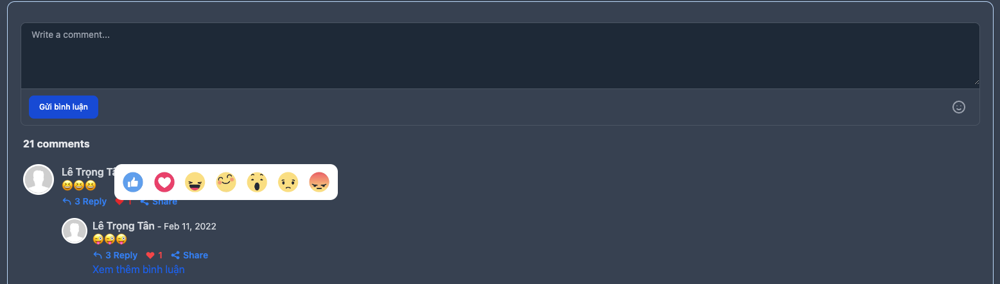

# Yêu cầu
[Livewire](https://laravel-livewire.com/docs/2.x/installation)

[Tailwind](https://tailwindcss.com/docs/installation)

# Cài đặt
```bash
composer require hrm/laravel-comment
```
## Publish 
```bash
php artisan vendor:publish --tag=comments
```

## Migrations

```bash 
php artisan migrate
```

Thêm Trait vào Model

`use HasComments;`

Thêm helper vào `composer.json` như mẫu dưới


```json
 "autoload": {
        "psr-4": {
            "App\\": "app/",
            "Database\\Factories\\": "database/factories/",
            "Database\\Seeders\\": "database/seeders/"
        },
        "files": [
            "app/Helper/hrm_time_helper.php"
        ]
    },
```

## Cách dùng

### Thêm componnent
Thêm commponent sau vào nơi hiển thị comment
`$post` là model của bạn

`<livewire:form-component :model="$post" :key="time().$post->id">`

Thêm `@stack('script)` vào layout của bạn

### Thay đổi định dạng thời gian comment

mở file `app/Helper/hrm_time_helper.php`

thay đổi nội dung trong function `hrmFormatTime()`


